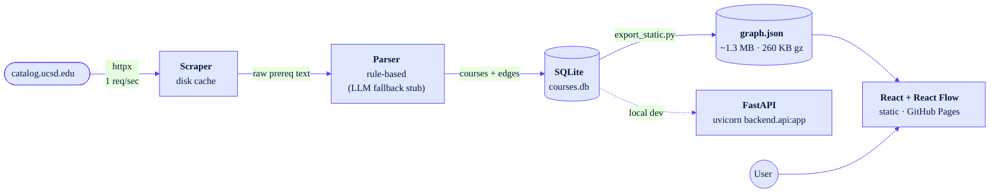

# UCSD Prereq Dependency Graph

Visualize course prerequisites at UC San Diego. Search a course, see its upstream prereq tree and downstream unlocks. Paste your completed courses to highlight what you're eligible for next.

**Live:** [https://cutesurtr.github.io/prereq-dependency/](https://cutesurtr.github.io/prereq-dependency/)
**Stats:** 2,018 courses · 3,259 prereq edges · 13 catalog pages · responsive (desktop + mobile drawer).

## Architecture



## Stack

- **Backend:** Python 3.11, FastAPI, SQLAlchemy, SQLite. The full DB is dumped to `frontend/public/graph.json` at build time so the deployed app is **pure static** (no serverless cold starts, no DB to provision). FastAPI still runs locally for dev / future iteration.
- **Scraper:** `httpx` + `selectolax`, polite 1 req/sec rate limit, on-disk HTML cache.
- **Parser:** Hand-rolled, ~63 unit tests; ambiguous strings flagged for LLM fallback (stub interface — wire up an Anthropic key later).
- **Frontend:** Vite + React + TypeScript, [React Flow](https://reactflow.dev) for the graph. Stripe-inspired palette (Inter + JetBrains Mono, navy/purple, blue-tinted shadows). Responsive: desktop two-column, mobile slide-down drawer.
- **Deploy:** GitHub Pages (Vercel config available too).
- **CI:** GitHub Actions — `ruff`, `mypy`, `pytest`, `tsc`, Playwright e2e.

## Local development

### Backend

```bash
python3.11 -m venv .venv
source .venv/bin/activate
pip install -e ".[dev]"
# scrape (defaults to every configured catalog page; cached after first run)
python -m backend.scraper
# build the local SQLite DB from scraped JSON
python -m backend.loader
# export DB to the static JSON the frontend reads
python -m backend.export_static
# (optional) run the FastAPI server locally
uvicorn backend.api:app --reload
```

### Frontend

```bash
cd frontend
npm install
npm run dev   # http://localhost:5173, proxies /api to the backend
```

### Tests

```bash
pytest                # backend parser tests
cd frontend && npx tsc --noEmit
cd frontend && npm run test:e2e   # Playwright smoke
```

## Deploy

### GitHub Pages (default)

The [`Deploy to GitHub Pages`](.github/workflows/deploy.yml) workflow runs on every push to `main`. It builds the frontend with `VITE_BASE=/prereq-dependency/` and uploads `frontend/dist` to Pages.

Refresh data when the catalog changes:

```bash
rm -rf data/cache/   # bypass HTTP cache
python -m backend.scraper
python -m backend.loader
python -m backend.export_static
git add frontend/public/graph.json data/raw/
git commit -m "Refresh course data"
git push
```

### Vercel (alternative)

[vercel.json](vercel.json) is also wired up. `vercel link` once, then `git push` — Vercel will pick up changes to `frontend/`, `data/`, `backend/export_static.py`, or `vercel.json` (others are skipped via `ignoreCommand`).

The deploy is **pure static** (no serverless functions, no database). All ~2,018 courses + ~3,259 prereq edges fit in ~1.3 MB of JSON (~260 KB gzipped) and load in one fetch.

## Scope

Catalog pages currently scraped: MATH, PHYS, CHEM, BIOL (covers BIBC / BICD / BIEB / BILD / BIMM / BIPN / BISP), CSE, ECE, MAE, BENG, NANO, SE, ECON, DSC, COGS.

Adding another department is a one-line addition in [`SCRAPED_CATALOGS`](backend/scraper.py).

Cross-department prereqs are handled naturally — a BICD course requiring CHEM 7L resolves correctly because the prereq edge is keyed by course code, not department. MAE 20A's PHYS prereqs unlock physics paths; CSE 100's MATH alternatives all resolve.

## Parsing strategy

UCSD prereq prose is messier than it looks. The parser is rule-based and runs in this pipeline:

1. **Detect the kind** of prereq from a leading marker:
   - `Recommended preparation:` → `RECOMMENDED` (non-blocking)
   - `Corequisite:` / `Concurrent enrollment in` → `COREQ`
   - default → `PREREQ`
2. **Normalize course code casing and leading zeros** — `Math 20D` → `MATH 20D`, `MAE 08` → `MAE 8`. The catalog is inconsistent: MAE zero-pads single-digit course numbers in its course-name listing (`MAE 08`) but uses the unpadded form (`MAE 8`) in prereq prose. Without this step, the loader drops every reference to those courses as "unknown".
3. **Strip non-blocking notes** (`consent of instructor`, `dept approval`, `Students who have not completed listed prerequisites may enroll…`, `Students may not receive credit for X and Y`, `Renumbered from X`) into a separate `notes` field.
4. **Drop non-course atoms**: `Math Placement Exam qualifying score`, `AP Calculus AB score of 3, 4, or 5`, `with a grade of C– or better`, `(or equivalent)`. The AP / score patterns are written to consume the full comma chain (`score of 3, 4, or 5` is one drop, not three) so leftover loose numbers don't pollute downstream parsing.
5. **Expand bare course numbers**: `MATH 20A, 20B, and 20C` → `MATH 20A, MATH 20B, MATH 20C`.
6. **Make implicit groupings explicit**:
   - `either A or B or C` → `(A or B or C)`
   - `EDS 30/MATH 95` → `(EDS 30 or MATH 95)`
   - `PHYS 4A-B-C` → `PHYS 4A and PHYS 4B and PHYS 4C` (catalog series shorthand)
   - `X and Y or Z [or W ...]` at clause end → `X and (Y or Z [or W ...])` (catalog convention; AND binds looser than the alternatives chain — strict precedence would let a student satisfy with `Z` alone)
   - `X or Y or Z and W` at clause start (3+ courses in OR chain) → `(X or Y or Z) and W` (mirror of the previous heuristic for leading OR-chains)
7. **Tokenize** to `COURSE | AND | OR | LPAREN | RPAREN | COMMA`.
8. **Resolve commas**:
   - `, and` / `, or` → elevate to `TOP_AND` / `TOP_OR` (binds *looser* than regular AND/OR — captures comma-elevated scope)
   - bare `,` between two OR-clauses (parallel-OR pattern) → `TOP_AND` (so `MATH 18 or MATH 31AH, MATH 20C or MATH 31BH` reads as `(18|31AH) and (20C|31BH)`)
   - bare `,` in a regular list → adopt the kind of the next conjunction
9. **Recursive-descent parse** to an AST with three precedence levels (TOP_*, OR, AND), and **DNF-expand** to a list of `frozenset`s. Each `frozenset` becomes one `group_id` in the DB; AND within, OR across.

The loader applies one more invariant: a group containing the course as its own prereq, or a course that doesn't exist in our scraped data, is dropped *as a whole* (not just the offending edge). Dropping a single edge from an AND group leaves a strict subset that's too easy to satisfy — e.g., `(MAE 101A or CENG 101A) AND (MAE 11 or MAE 110A or CENG 102)` would otherwise produce a group `{MAE 11}` alone, which contradicts the original intent.

| Pattern | Example | Result |
|---|---|---|
| Single | `MATH 20A` | one AND group |
| AND | `MATH 20A and MATH 20B` | one group `{20A, 20B}` |
| OR | `MATH 20A or MATH 10A` | two groups `{20A}, {10A}` |
| Oxford list | `MATH 20A, 20B, and 20C` | one group `{20A, 20B, 20C}` |
| Mixed paren | `MATH 20A and (MATH 20B or MATH 10B)` | `{20A, 20B}, {20A, 10B}` |
| Comma-scope | `MATH 18 or MATH 20F or MATH 31AH, and MATH 20C` | `{18,20C}, {20F,20C}, {31AH,20C}` |
| Trailing OR-chain | `PHYS 2A and MATH 31BH or MATH 20C` | `{PHYS 2A, MATH 31BH}, {PHYS 2A, MATH 20C}` |
| Leading OR-chain | `CSE 21 or MATH 154 or MATH 188 and CSE 12` | `{CSE 21, CSE 12}, {MATH 154, CSE 12}, {MATH 188, CSE 12}` |
| Parallel-OR comma | `MATH 18 or MATH 31AH, MATH 20C or MATH 31BH` | `{18,20C}, {18,31BH}, {31AH,20C}, {31AH,31BH}` |
| Hyphen series | `PHYS 4A-B` | `{PHYS 4A, PHYS 4B}` |
| Slash | `EDS 30/MATH 95` | `{EDS 30}, {MATH 95}` |
| `either` | `either MATH 20F or MATH 31AH` | `{20F}, {31AH}` |
| Leading-zero | `MAE 08, MAE 09, MAE 11` | `{MAE 8, MAE 9, MAE 11}` |
| `or equivalent` | `MATH 20A or equivalent` | `{20A}` |
| Grade qualifier | `MATH 20B with a grade of C– or better` | `{20B}` |
| AP score | `AP Calculus BC score of 4 or 5, or MATH 20B` | `{20B}` |
| Placement only | `Math Placement Exam qualifying score.` | `[]` (no edges) |
| Corequisite | `Corequisite: PHYS 2A` | one COREQ group |
| Recommended | `Recommended preparation: MATH 20A and MATH 20B` | one RECOMMENDED group |
| Consent | `…with consent of instructor.` | `notes="consent of instructor"` |
| Duplicate-credit | `Students may not receive credit for both CSE 100R and CSE 100.` | dropped (not a prereq) |

**Confidence flag.** Parser sets `confident=False` when the set of course codes it extracted differs from what the regex finds in the cleaned body — the typical cause is a truly ambiguous string like `MATH 18 or MATH 20F or MATH 31AH and MATH 20C (or MATH 21C) or MATH 31BH` where operator precedence is genuinely unclear from the prose alone. Unconfident strings are stored as `raw_prereq_text` and surfaced in the UI. The unparseable ones are queued for the (currently stubbed) Haiku fallback in `backend/llm_fallback.py`.

**Catalog HTML quirks.** The `Prerequisites:` marker appears in three different `<strong>`/`<em>` nestings across the live site (`<strong class="italic"><em>...`, `<strong><em><em>...`, `<em><strong>...`). The scraper regex tolerates any combination, recovering ~1,100 edges that were previously dropped. Course titles wrapped in `<span>` (like `MAE 30A. <span>Statics</span> (4)`) are extracted with a space separator so the header regex still matches.

## Data model

Two tables.

```sql
courses(code PK, title, department, units, description, raw_prereq_text, notes)
prereqs(id PK, course_code FK, group_id, required_course_code FK, prereq_type)
-- Within a group_id: AND. Across group_ids for the same course: OR.
```

This models `(MATH 20A and MATH 20B) or (MATH 10A and MATH 10B)` as group 0 = {20A, 20B}, group 1 = {10A, 10B}.

## Next steps

- Wire up Anthropic Haiku LLM fallback for unparsed prereq strings (interface is stubbed in `backend/llm_fallback.py`).
- Add more catalog pages beyond the current set.
- Add `units` to the completed-courses panel so users can track progress toward graduation.
- Quarter-aware scheduling (typically-offered-in-Fall vs. Winter vs. Spring) — this requires a different data source than the catalog.
- Schema-aware admin endpoint so non-engineers can correct misparsed prereqs.

## Anti-goals

No auth, no user accounts. No admin panel. No graph database.
