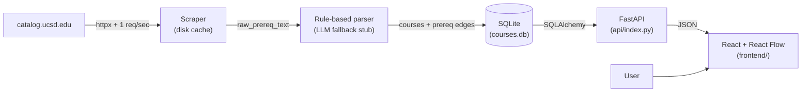

# UCSD Prereq Dependency Graph

Visualize course prerequisites at UC San Diego. Search a course, see its upstream prereq tree and downstream unlocks. Paste your completed courses to highlight what you're eligible for next.

**Status:** v1 in progress. Live URL coming once Vercel deploy lands.

## Architecture



## Stack

- **Backend:** Python 3.11, FastAPI, SQLAlchemy, SQLite (read-only at deploy time, bundled with the serverless function)
- **Scraper:** `httpx` + `selectolax`, polite 1 req/sec rate limit, on-disk HTML cache
- **Parser:** Hand-rolled prereq parser; ambiguous strings flagged for LLM fallback (stub interface — wire up an Anthropic key later)
- **Frontend:** Vite + React + TypeScript, [React Flow](https://reactflow.dev) for the graph
- **Deploy:** Vercel (static frontend + Python serverless API)
- **CI:** GitHub Actions — `ruff`, `mypy`, `pytest`, `tsc`

## Local development

### Backend

```bash
python3.11 -m venv .venv
source .venv/bin/activate
pip install -e ".[dev]"
# scrape one department
python -m backend.scraper MATH
# build the local SQLite DB from cached HTML
python -m backend.loader
# run the API
uvicorn backend.api:app --reload
```

### Frontend

```bash
cd frontend
npm install
npm run dev   # http://localhost:5173, proxies /api to the backend
```

### Tests

```bash
pytest                # backend parser tests
cd frontend && npx tsc --noEmit
cd frontend && npm run test:e2e   # Playwright smoke
```

## Deploy

### Vercel

1. `vercel link` (one-time)
2. `vercel --prod`

The build command is configured in `vercel.json`. The SQLite DB is committed under `backend/data/courses.db` so the serverless function has read access to it at runtime — re-scrape locally and re-deploy to refresh.

## Scope (Tier 1 majors only for v1)

MATH, PHYS, CHEM, BIBC/BICD/BIEB/BILD/BIMM/BIPN (Biological Sciences), CSE, ECE, MAE, BENG, NANO, SE.

Cross-department prereqs are handled naturally — a BICD course requiring CHEM 7L or whatever resolves correctly because the prereq edge is keyed by course code, not department.

## Parsing strategy

The parser handles these cases. See `tests/test_parser.py` for verified examples:

| Pattern | Example | Result |
|---|---|---|
| Single | `MATH 20A` | one AND group with one course |
| AND | `MATH 20A and MATH 20B` | one AND group, two courses |
| OR | `MATH 20A or MATH 10A` | two groups (each one course) |
| List | `MATH 20A, 20B, and 20C` | one AND group, three courses (department inferred) |
| Mixed | `MATH 20A and (MATH 20B or MATH 10B)` | two groups: {20A,20B} OR {20A,10B} |
| `or equivalent` | `MATH 20A or equivalent` | dropped to notes |
| Corequisite | `corequisite of PHYS 2A` | recorded with `prereq_type=COREQ` |
| Recommended prep | `Recommended preparation: ...` | `prereq_type=RECOMMENDED` |
| Consent / approval | `consent of instructor` | dropped to non-blocking notes field |

Strings the rule-based parser cannot confidently handle are stored verbatim in `courses.raw_prereq_text` and flagged for LLM fallback (Anthropic Haiku, cached by string hash).

## Data model

Two tables.

```sql
courses(code PK, title, department, units, description, raw_prereq_text, notes)
prereqs(id PK, course_code FK, group_id, required_course_code FK, prereq_type)
-- Within a group_id: AND. Across group_ids for the same course: OR.
```

This models `(MATH 20A and MATH 20B) or (MATH 10A and MATH 10B)` as group 0 = {20A, 20B}, group 1 = {10A, 10B}.

## Next steps

- Wire up Anthropic Haiku LLM fallback for unparsed prereq strings (interface is stubbed in `backend/llm_fallback.py`).
- Add the rest of the College/Majors beyond Tier 1.
- Add `units` to the completed-courses panel so users can track progress toward graduation.
- Quarter-aware scheduling (typically-offered-in-Fall vs. Winter vs. Spring) — this requires a different data source than the catalog.
- Schema-aware admin endpoint so non-engineers can correct misparsed prereqs.

## Anti-goals

No auth, no user accounts. No admin panel. No graph database. No additional majors beyond Tier 1 in v1.
