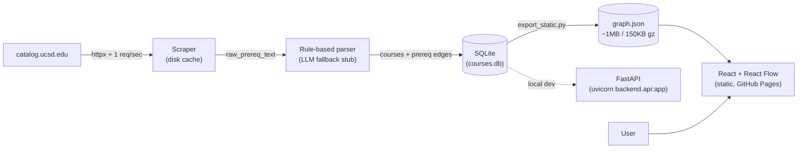

# UCSD Prereq Dependency Graph

Visualize course prerequisites at UC San Diego. Search a course, see its upstream prereq tree and downstream unlocks. Paste your completed courses to highlight what you're eligible for next.

**Live:** [https://cutesurtr.github.io/prereq-dependency/](https://cutesurtr.github.io/prereq-dependency/)
**Stats:** 1,650 courses · 1,904 prereq edges · 99% confident parses on the MATH corpus.

## Architecture



## Stack

- **Backend:** Python 3.11, FastAPI, SQLAlchemy, SQLite. The full DB is dumped to `frontend/public/graph.json` at build time so the deployed app is **pure static** (no serverless cold starts, no DB to provision). The FastAPI API still runs locally for dev / future iteration.
- **Scraper:** `httpx` + `selectolax`, polite 1 req/sec rate limit, on-disk HTML cache.
- **Parser:** Hand-rolled prereq parser; ambiguous strings flagged for LLM fallback (stub interface — wire up an Anthropic key later).
- **Frontend:** Vite + React + TypeScript, [React Flow](https://reactflow.dev) for the graph.
- **Deploy:** Vercel (static).
- **CI:** GitHub Actions — `ruff`, `mypy`, `pytest`, `tsc`.

## Local development

### Backend

```bash
python3.11 -m venv .venv
source .venv/bin/activate
pip install -e ".[dev]"
# scrape (defaults to all Tier 1 majors; cached after first run)
python -m backend.scraper
# build the local SQLite DB from scraped JSON
python -m backend.loader
# export DB to the static JSON the frontend reads
python -m backend.export_static
# (optional) run the FastAPI server locally
uvicorn backend.api:app --reload
```

### Frontend

```bash
cd frontend
npm install
npm run dev   # http://localhost:5173, proxies /api to the backend
```

### Tests

```bash
pytest                # backend parser tests
cd frontend && npx tsc --noEmit
cd frontend && npm run test:e2e   # Playwright smoke
```

## Deploy

### GitHub Pages (default)

The [`Deploy to GitHub Pages`](.github/workflows/deploy.yml) workflow runs on every push to `main`. It builds the frontend with `VITE_BASE=/prereq-dependency/` and uploads `frontend/dist` to Pages.

Refresh data when the catalog changes:

```bash
rm -rf data/cache/   # bypass HTTP cache
python -m backend.scraper
python -m backend.loader
python -m backend.export_static
git add frontend/public/graph.json data/raw/
git commit -m "Refresh course data"
git push
```

### Vercel (alternative)

[vercel.json](vercel.json) is also wired up. `vercel link` once, then `git push` — Vercel will pick up changes to `frontend/`, `data/`, `backend/export_static.py`, or `vercel.json` (others are skipped via `ignoreCommand`).

The deploy is **pure static** (no serverless functions, no database). All ~1,650 courses + 1,900 prereq edges fit in ~1MB of JSON (~150KB gzipped) and load in one fetch.

## Scope (Tier 1 majors only for v1)

MATH, PHYS, CHEM, BIBC/BICD/BIEB/BILD/BIMM/BIPN (Biological Sciences), CSE, ECE, MAE, BENG, NANO, SE.

Cross-department prereqs are handled naturally — a BICD course requiring CHEM 7L or whatever resolves correctly because the prereq edge is keyed by course code, not department.

## Parsing strategy

UCSD prereq prose is messier than it looks. The parser is rule-based and runs in this pipeline:

1. **Detect the kind** of prereq from a leading marker:
   - `Recommended preparation:` → `RECOMMENDED` (non-blocking)
   - `Corequisite:` / `Concurrent enrollment in` → `COREQ`
   - default → `PREREQ`
2. **Strip non-blocking notes** (`consent of instructor`, `dept approval`, `Students who have not completed listed prerequisites may enroll…`) into a separate `notes` field.
3. **Drop non-course atoms**: `Math Placement Exam qualifying score`, `AP Calculus AB score of 3, 4, or 5`, `with a grade of C– or better`, `(or equivalent)`. The AP / score patterns are written to consume the full comma chain (`score of 3, 4, or 5` is one drop, not three) so leftover loose numbers don't pollute downstream parsing.
4. **Make implicit groupings explicit**: `either A or B or C` → `(A or B or C)`; slash syntax `EDS 30/MATH 95` → `(EDS 30 or MATH 95)`. This way the existing AND/OR precedence rules give the right answer.
5. **Expand bare course numbers**: `MATH 20A, 20B, and 20C` → `MATH 20A, MATH 20B, MATH 20C`.
6. **Tokenize** to `COURSE | AND | OR | LPAREN | RPAREN | COMMA`. Course codes are case-insensitive (some prereq strings use `Math 20D`).
7. **Resolve commas**:
   - `, and` / `, or` → elevate to `TOP_AND` / `TOP_OR` (binds *looser* than regular AND/OR — captures comma-elevated scope)
   - bare `,` in a list → adopt the kind of the next conjunction
8. **Recursive-descent parse** to an AST with three precedence levels (TOP_*, OR, AND), and **DNF-expand** to a list of `frozenset`s. Each `frozenset` becomes one `group_id` in the DB; AND within, OR across.

This is the case where TOP-level scope matters — without it, this string parses wrong:

> `MATH 18 or MATH 20F or MATH 31AH, and MATH 20C.`

Standard precedence (AND tighter than OR) would give `MATH 18 OR MATH 20F OR (MATH 31AH AND MATH 20C)`. The English clearly means `(18 or 20F or 31AH) and 20C`. The `, and` is the signal — comma-elevated AND binds looser, so the grouping resolves correctly.

| Pattern | Example | Result |
|---|---|---|
| Single | `MATH 20A` | one AND group |
| AND | `MATH 20A and MATH 20B` | one group `{20A, 20B}` |
| OR | `MATH 20A or MATH 10A` | two groups `{20A}, {10A}` |
| Oxford list | `MATH 20A, 20B, and 20C` | one group `{20A, 20B, 20C}` |
| Mixed paren | `MATH 20A and (MATH 20B or MATH 10B)` | `{20A, 20B}, {20A, 10B}` |
| Comma-scope | `MATH 18 or MATH 20F or MATH 31AH, and MATH 20C` | `{18,20C}, {20F,20C}, {31AH,20C}` |
| Slash | `EDS 30/MATH 95` | `{EDS 30}, {MATH 95}` |
| `either` | `either MATH 20F or MATH 31AH` | `{20F}, {31AH}` |
| `or equivalent` | `MATH 20A or equivalent` | `{20A}` |
| Grade qualifier | `MATH 20B with a grade of C– or better` | `{20B}` |
| AP score | `AP Calculus BC score of 4 or 5, or MATH 20B` | `{20B}` |
| Placement only | `Math Placement Exam qualifying score.` | `[]` (no edges) |
| Corequisite | `Corequisite: PHYS 2A` | one COREQ group |
| Recommended | `Recommended preparation: MATH 20A and MATH 20B` | one RECOMMENDED group |
| Consent | `…with consent of instructor.` | `notes="consent of instructor"` |

**Confidence flag.** Parser sets `confident=False` when the set of course codes it extracted differs from what the regex finds in the cleaned body — the typical cause is a truly ambiguous string like `MATH 18 or MATH 20F or MATH 31AH and MATH 20C (or MATH 21C) or MATH 31BH` where operator precedence is genuinely unclear from the prose alone. Unconfident strings are stored as `raw_prereq_text` and surfaced in the UI; on the MATH corpus 99% of strings (194/196 with prereq prose) parse confidently. The unparseable ones are queued for the (currently stubbed) Haiku fallback in `backend/llm_fallback.py`.

## Data model

Two tables.

```sql
courses(code PK, title, department, units, description, raw_prereq_text, notes)
prereqs(id PK, course_code FK, group_id, required_course_code FK, prereq_type)
-- Within a group_id: AND. Across group_ids for the same course: OR.
```

This models `(MATH 20A and MATH 20B) or (MATH 10A and MATH 10B)` as group 0 = {20A, 20B}, group 1 = {10A, 10B}.

## Next steps

- Wire up Anthropic Haiku LLM fallback for unparsed prereq strings (interface is stubbed in `backend/llm_fallback.py`).
- Add the rest of the College/Majors beyond Tier 1.
- Add `units` to the completed-courses panel so users can track progress toward graduation.
- Quarter-aware scheduling (typically-offered-in-Fall vs. Winter vs. Spring) — this requires a different data source than the catalog.
- Schema-aware admin endpoint so non-engineers can correct misparsed prereqs.

## Anti-goals

No auth, no user accounts. No admin panel. No graph database. No additional majors beyond Tier 1 in v1.
