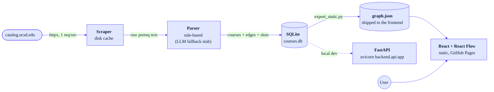

# UCSD Prereq Dependency Graph

Search any UC San Diego course and see its upstream prerequisite tree, downstream unlocks, and the constraints that gate it: OR-alternatives, class standing, major-code restrictions, and the transitively-implied prereqs that other tools list as noise. Pure static site, no backend, no auth, no accounts.

**Live:** [https://cutesurtr.github.io/prereq-dependency/](https://cutesurtr.github.io/prereq-dependency/)

Covers MATH, PHYS, CHEM, the BIOL family (BIBC / BICD / BIEB / BILD / BIMM / BIPN / BISP), CSE, ECE, MAE, BENG, NANO, SE, ECON, DSC, COGS. The recursive chain layout lazy-loads only when you open it, so the depth-1 view stays light.

## What you can do

The sidebar drives everything, and every choice persists across sessions in `localStorage`.

**Read the graph**

* Search a course, the graph centers on it. Prereqs on the left, unlocks on the right.
* Paste a list of completed courses, eligible next courses light up green with a checkmark.
* Switch upstream depth from "Direct prereqs only" to "2 / 3 / 5 levels up" or "Full upstream chain". The recursive views lay out as a real layered DAG via `dagre`.

**Shape the OR-prereqs**

* Multi-alternative slots render as a "1 of N" join pill with a single AND edge to the focus. CSE 100's notorious DNF combinations collapse to three readable slots.
* Click an alternative to pick it. The slot collapses to your choice with a purple checkmark, plus a "+N hidden change" pill that undoes the pick. A second click on the picked card navigates to that course.
* "Hide this course" on the focus card removes it from every slot, unlock list, and chain across the graph. The sidebar muted list has per-row Unhide and bulk Unhide all.

**Filter by who you are**

* **My departments**: type a comma-separated list (`CSE, MATH`). Out-of-dept prereqs fade.
* **Hide out-of-dept (except STEM core)**: stricter, removes non-foundation out-of-dept courses entirely. The curated [foundation list](frontend/src/foundations.ts) (MATH 20 series, PHYS 1/2/4, CHEM 6/40/41, BILD 1-4, etc.) is exempt.
* **My class standing** + **Hide courses above my standing**: gates by frosh / soph / junior / senior / grad. Courses with a standing requirement carry a `Jr+ / Sr+ / Grad` corner badge regardless of the filter.
* **My major code(s)** + **Hide courses my major can't take**: courses with explicit major-code allow-lists (e.g. CSE 197 is `CS25 / CS26 / CS27 / CS29` only). Eligible courses show a gray `Majors` badge, locked ones show a red `Major-locked`.
* **Hide redundant prereqs (cascading)**: drops directly-listed prereqs that some other direct prereq already requires transitively. PHYS 100B's `{MATH 20A, MATH 20B, MATH 20C, MATH 31BH, PHYS 100A}` slot reduces to just `PHYS 100A`.

## Architecture



## Stack

* **Scraper.** `httpx` + `selectolax`, polite 1 req/sec rate limit, on-disk HTML cache. The `Prerequisites:` marker appears in several different `<strong>`/`<em>` nestings across the live site; the regex tolerates all of them.
* **Parser.** Hand-rolled, well-tested. Produces DNF groups, factored AND-of-OR slots, class-standing markers, major-code restrictions, and prose-extracted notes. Ambiguous prereq strings are flagged for an LLM fallback (interface stubbed in `backend/llm_fallback.py`).
* **Backend.** Python 3.11, FastAPI, SQLAlchemy, SQLite. The full DB exports to `frontend/public/graph.json` at build time so the deployed app is pure static (no serverless cold starts, no DB to provision). FastAPI is dev-only.
* **Frontend.** Vite + React + TypeScript + [React Flow](https://reactflow.dev), plus [dagre](https://github.com/dagrejs/dagre) (lazy-loaded only when the chain view opens) for layered DAG layout. A small `ProfileContext` persists picks, mutes, departments, major codes, standing, and every filter toggle in `localStorage`. Stripe-inspired palette (Inter + JetBrains Mono, navy / purple, blue-tinted shadows). Responsive: desktop two-column, mobile slide-down drawer.
* **Deploy.** GitHub Pages by default; `vercel.json` is also wired up.
* **CI.** GitHub Actions: `ruff`, `mypy`, `pytest`, `tsc`, Playwright e2e.

## Local development

### Backend

```bash
python3.11 -m venv .venv
source .venv/bin/activate
pip install -e ".[dev]"
# Scrape every configured catalog page (cached after the first run)
python -m backend.scraper
# Build the local SQLite DB from scraped JSON
python -m backend.loader
# Export DB to the static JSON the frontend reads
python -m backend.export_static
# Optional: run the dev API
uvicorn backend.api:app --reload
```

### Frontend

```bash
cd frontend
npm install
npm run dev   # http://localhost:5173, proxies /api to the backend
```

### Tests

```bash
pytest                              # backend parser tests
cd frontend && npx tsc --noEmit     # type check
cd frontend && npm run test:e2e     # Playwright smoke
```

### Audit scripts

Two stand-alone scripts inspect the catalog without running the frontend:

```bash
python -m backend.analyze_cascade      # courses with redundant ("cascading") directs
python -m backend.analyze_foundations  # cross-department prereq workhorses
```

## Deploy

### GitHub Pages (default)

[`.github/workflows/deploy.yml`](.github/workflows/deploy.yml) runs on every push to `main`. It builds the frontend with `VITE_BASE=/prereq-dependency/` and uploads `frontend/dist` to Pages.

Refresh data when the catalog changes:

```bash
rm -rf data/cache/
python -m backend.scraper
python -m backend.loader
python -m backend.export_static
git add frontend/public/graph.json data/raw/
git commit -m "refresh course data"
git push
```

### Vercel (alternative)

[`vercel.json`](vercel.json) is wired up too. `vercel link` once, then push. The `ignoreCommand` skips deploys when only unrelated paths change.

The deploy is pure static. The full course catalog and prereq graph load in one fetch.

## Parsing strategy

UCSD prereq prose is messier than it looks. The parser is rule-based and runs in this pipeline:

1. **Detect the kind** from a leading marker. `Recommended preparation:` becomes `RECOMMENDED` (non-blocking). `Corequisite:` / `Concurrent enrollment in` becomes `COREQ`. Default is `PREREQ`.
2. **Normalize course code casing and leading zeros**. `Math 20D` becomes `MATH 20D`; `MAE 08` becomes `MAE 8`. The catalog uses both forms inconsistently; without this step the loader drops every reference to those courses as "unknown".
3. **Strip non-blocking notes** (`consent of instructor`, `dept approval`, `Students who have not completed listed prerequisites may enroll...`, `Students may not receive credit for X and Y`, `Renumbered from X`) into a separate `notes` field.
4. **Drop non-course atoms**: `Math Placement Exam qualifying score`, `AP Calculus AB score of 3, 4, or 5`, `with a grade of C- or better`, `(or equivalent)`. The AP / score patterns are written to consume the full comma chain so leftover loose numbers don't pollute downstream parsing.
5. **Expand bare course numbers**: `MATH 20A, 20B, and 20C` becomes `MATH 20A, MATH 20B, MATH 20C`.
6. **Make implicit groupings explicit**:
   * `either A or B or C` becomes `(A or B or C)`
   * `EDS 30/MATH 95` becomes `(EDS 30 or MATH 95)`
   * `PHYS 4A-B-C` becomes `PHYS 4A and PHYS 4B and PHYS 4C` (catalog series shorthand)
   * `X and Y or Z [or W ...]` at clause end becomes `X and (Y or Z [or W ...])` (the catalog convention is that AND binds looser than the alternatives chain)
   * `X or Y or Z and W` at clause start (3+ courses in OR chain) becomes `(X or Y or Z) and W` (mirror of the previous heuristic for leading OR-chains)
7. **Tokenize** to `COURSE | AND | OR | LPAREN | RPAREN | COMMA`.
8. **Resolve commas**:
   * `, and` / `, or` elevate to `TOP_AND` / `TOP_OR`, which bind looser than regular AND/OR.
   * A bare `,` between two OR-clauses (parallel-OR pattern) becomes `TOP_AND`, so `MATH 18 or MATH 31AH, MATH 20C or MATH 31BH` reads as `(18|31AH) and (20C|31BH)`.
   * A bare `,` in a regular list adopts the kind of the next conjunction.
9. **Recursive-descent parse** to an AST with three precedence levels (TOP_*, OR, AND), then produce two projections:
   * **DNF groups** for the eligibility check (a list of AND-bundles; one bundle satisfies the prereq).
   * **Factored slots** for visualization (a flat list of OR-slots that are AND-joined). Most courses factor cleanly; the rest fall back to DNF rendering.

After the parser, the loader applies one more invariant: a group containing the course as its own prereq, or a course that doesn't exist in the scraped data, is dropped *as a whole* (not just the offending edge). Dropping a single edge from an AND group leaves a strict subset that's too easy to satisfy. For example, `(MAE 101A or CENG 101A) AND (MAE 11 or MAE 110A or CENG 102)` would otherwise produce a group `{MAE 11}` alone, which contradicts the original intent.

The loader also runs two structured-data detectors over the same prose:

* **`detect_standing`**: picks up `graduate standing`, `junior or senior standing`, `senior standing`, `upper-division standing`. Defaults to `graduate` for 200+ course numbers when prose is silent.
* **`detect_restricted_majors`**: extracts explicit major-code allow-lists like `Restricted to CS25, CS26, CS27, and CS29 majors only`. Expands ranges like `MC 30-37`. Conservative: only triggers when the catalog text gates with codes near a `majors only` / `Restricted to` / `Open to` phrasing, so department-consent gates don't get mis-flagged.

### Parsing examples

| Pattern | Example | Result |
|---|---|---|
| Single | `MATH 20A` | one AND group |
| AND | `MATH 20A and MATH 20B` | one group `{20A, 20B}` |
| OR | `MATH 20A or MATH 10A` | two groups `{20A}, {10A}` |
| Oxford list | `MATH 20A, 20B, and 20C` | one group `{20A, 20B, 20C}` |
| Mixed paren | `MATH 20A and (MATH 20B or MATH 10B)` | `{20A, 20B}, {20A, 10B}` |
| Comma-scope | `MATH 18 or MATH 20F or MATH 31AH, and MATH 20C` | `{18,20C}, {20F,20C}, {31AH,20C}` |
| Trailing OR-chain | `PHYS 2A and MATH 31BH or MATH 20C` | `{PHYS 2A, MATH 31BH}, {PHYS 2A, MATH 20C}` |
| Leading OR-chain | `CSE 21 or MATH 154 or MATH 188 and CSE 12` | `{CSE 21, CSE 12}, {MATH 154, CSE 12}, {MATH 188, CSE 12}` |
| Parallel-OR comma | `MATH 18 or MATH 31AH, MATH 20C or MATH 31BH` | `{18,20C}, {18,31BH}, {31AH,20C}, {31AH,31BH}` |
| Hyphen series | `PHYS 4A-B` | `{PHYS 4A, PHYS 4B}` |
| Slash | `EDS 30/MATH 95` | `{EDS 30}, {MATH 95}` |
| `either` keyword | `either MATH 20F or MATH 31AH` | `{20F}, {31AH}` |
| Leading-zero | `MAE 08, MAE 09, MAE 11` | `{MAE 8, MAE 9, MAE 11}` |
| `or equivalent` | `MATH 20A or equivalent` | `{20A}` |
| Grade qualifier | `MATH 20B with a grade of C- or better` | `{20B}` |
| AP score | `AP Calculus BC score of 4 or 5, or MATH 20B` | `{20B}` |
| Placement only | `Math Placement Exam qualifying score.` | `[]` (no edges) |
| Corequisite | `Corequisite: PHYS 2A` | one COREQ group |
| Recommended | `Recommended preparation: MATH 20A and MATH 20B` | one RECOMMENDED group |
| Consent | `...with consent of instructor.` | `notes="consent of instructor"` |
| Duplicate-credit | `Students may not receive credit for both CSE 100R and CSE 100.` | dropped (not a prereq) |
| Standing | `BENG 204: ...graduate standing.` | `required_standing="graduate"` |
| Major restriction | `Restricted to CS25, CS26, CS27, and CS29 majors only.` | `restricted_to_majors=["CS25","CS26","CS27","CS29"]` |
| Range expansion | `MC 25, MC 27, MC 29, and MC 30-37 majors only` | includes MC30..MC37 |

The parser also sets a `confident=False` flag when the set of course codes it extracted disagrees with what the regex finds in the cleaned body. The typical cause is a truly ambiguous string like `MATH 18 or MATH 20F or MATH 31AH and MATH 20C (or MATH 21C) or MATH 31BH` where operator precedence is genuinely unclear from the prose alone. Unconfident strings are stored as `raw_prereq_text` and surfaced in the UI; the unparseable ones are queued for the stubbed Haiku fallback in `backend/llm_fallback.py`.

## UI filter pipeline

The graph reads one focused course, computes its prereqs and unlocks, and pushes every alternative through this pipeline in order:

```
slot's original alts
  -> remove user-muted courses          (mute renders dimmed + "Unreachable" banner if slot empties)
       -> remove cascade-redundant       (toggle: hide redundant prereqs)
            -> remove out-of-dept ¬foundation  (toggle: hide out-of-dept)
                 -> remove standing-locked     (toggle: hide above my standing)
                      -> remove major-locked   (toggle: hide courses my major can't take)
                           -> if any non-mute filter empties the slot: drop it from layout
                                else render with `1 OF N` pill or single AND edge
```

Picks for the slot stay keyed by the original slot index, so toggling filters on or off never invalidates a saved pick. The recursive chain BFS uses the union of mute + dept + standing + major as its hidden-course predicate (cascade does not propagate, since redundancy is a per-focus property).

Class-standing and major-code restrictions also surface as corner badges on each course card:

* `Jr+ / Sr+ / Grad` standing pill (top-left, gray)
* `Majors` informational pill, or `Major-locked` red pill if the user's set major codes don't satisfy

The focus card itself never shows badges (you are already viewing that course intentionally).

## Data model

Two tables.

```sql
courses(
  code PK, title, department, units, description,
  raw_prereq_text, notes,
  prereq_slots_json,
  required_standing,
  restricted_to_majors_json
)
prereqs(id PK, course_code FK, group_id, required_course_code FK, prereq_type)
-- Within a group_id: AND. Across group_ids for the same course: OR.
```

So `(MATH 20A and MATH 20B) or (MATH 10A and MATH 10B)` lives as group 0 = `{20A, 20B}`, group 1 = `{10A, 10B}`.

`prereq_slots_json` is the factored AND-of-OR projection of the same prereq AST. For CSE 100 it looks like `[["CSE 21","MATH 154","MATH 158","MATH 184","MATH 188"], ["CSE 12"], ["CSE 15L","CSE 29","ECE 15"]]`. Nullable: only present when the parser factored the prose into flat slots. The frontend prefers slots and falls back to `prereq_groups` (DNF) when null.

`restricted_to_majors_json` is a JSON list of major codes (`["CS25","CS26","CS27","CS29"]`) when the catalog explicitly gates by major. `required_standing` is one of `junior` / `senior` / `graduate` (or null) and combines prose markers with the 200+ course-number convention.

## Scope

Adding another catalog page is a one-line addition in [`SCRAPED_CATALOGS`](backend/scraper.py). Cross-department prereqs are handled naturally: a BICD course requiring CHEM 7L resolves because edges are keyed by course code, not department. MAE 20A's PHYS prereqs unlock physics paths; CSE 100's MATH alternatives all resolve.

## Next steps

* Wire up the Anthropic Haiku LLM fallback for unparsed prereq strings (interface is stubbed in `backend/llm_fallback.py`). Would also unblock factored slots for the courses the rule-based parser currently can't factor.
* Add more catalog pages beyond the current set.
* **Pick-aware cascade.** The cascade analysis is conservative today: a prereq is only flagged as redundant when *every* OR alternative implies it. Folding the user's current picks into the mandatory-ancestor calculation would let cascade catch cases like CSE 120 ("CSE 29 is implied by CSE 30 given that you picked CSE 29 as CSE 30's alternative.").
* Add `units` to the completed-courses panel so users can track progress toward graduation.
* Quarter-aware scheduling (typically-offered-in-Fall vs. Winter vs. Spring). Requires a different data source than the catalog.
* Schema-aware admin endpoint so non-engineers can correct misparsed prereqs.
* Shareable URLs that encode picks, mutes, and toggle state in the hash so a student can DM their planned path to a friend without sharing `localStorage`.

## Anti-goals

No auth. No user accounts. No admin panel. No graph database.
